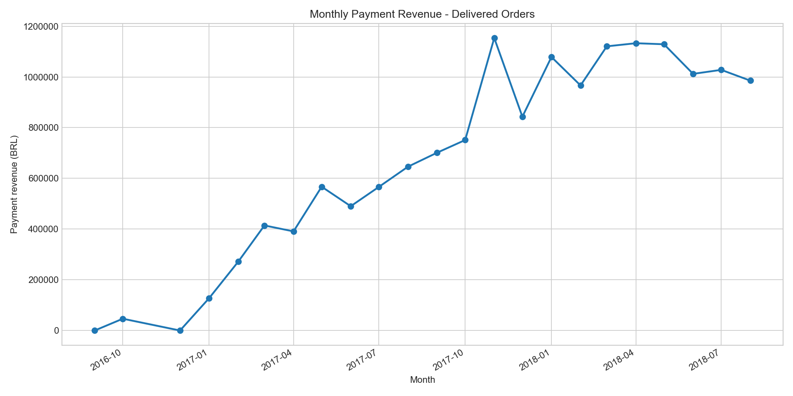
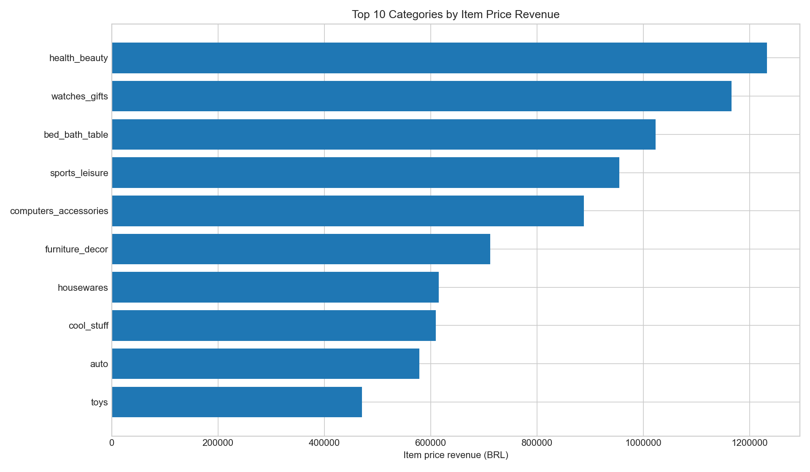
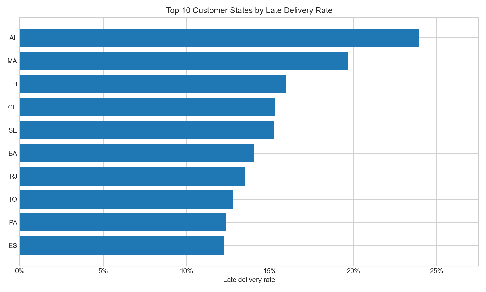
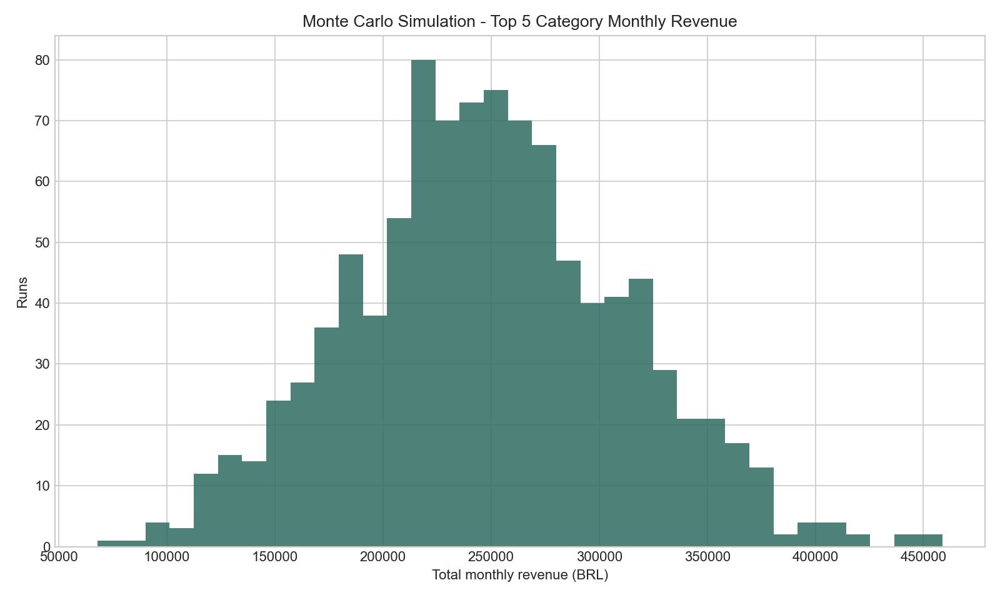

# Brazilian E-Commerce Operations Analytics

Operations analytics project for the Olist Brazilian e-commerce dataset. The project combines SQL, Python, exploratory analysis, optimization screening, and Monte Carlo simulation to evaluate marketplace revenue performance, category prioritization, delivery risk, and seller/logistics operations.

## Table of Contents

- [Project Overview](#project-overview)
- [Business Objectives](#business-objectives)
- [Dataset](#dataset)
- [Repository Structure](#repository-structure)
- [Analytical Workflow](#analytical-workflow)
- [Key Metrics](#key-metrics)
- [Main Findings](#main-findings)
- [Optimization and Simulation](#optimization-and-simulation)
- [Outputs](#outputs)
- [Setup and Usage](#setup-and-usage)
- [Reproducibility Notes](#reproducibility-notes)
- [Limitations](#limitations)
- [Next Steps](#next-steps)

## Project Overview

This project analyzes marketplace operations for Olist, a Brazilian e-commerce platform dataset covering orders, customers, sellers, products, payments, reviews, and delivery dates. The analysis focuses on delivered orders and uses the purchase timestamp as the main time axis.

The project answers questions such as:

- How did order volume, realized revenue, AOV, delivery performance, and customer review scores evolve over time?
- Which product categories drive the largest share of item revenue?
- Which customer states show the highest late-delivery risk?
- Which categories should be prioritized under quality and logistics constraints?
- How risky is a category-focused revenue strategy under simulated monthly revenue uncertainty?
- How likely is the platform to exceed a late-delivery SLA threshold?

## Business Objectives

The analysis is designed around operational decision-making rather than only descriptive reporting.

Primary objectives:

1. Measure marketplace health through revenue, orders, AOV, delivery reliability, and review score.
2. Identify high-value product categories and understand their contribution to platform revenue.
3. Detect geographic delivery-risk hotspots by customer state.
4. Build a category prioritization screen using revenue, review quality, and freight constraints.
5. Estimate downside risk for revenue concentration and late-delivery SLA performance.
6. Produce reusable tables, charts, a notebook, SQL logic, and a final business report.

## Dataset

The project uses the public Olist Brazilian e-commerce dataset, stored locally in the `Data/` directory.

Raw data files included:

| File | Description |
| --- | --- |
| `olist_orders_dataset.csv` | Order status and order lifecycle timestamps |
| `olist_order_items_dataset.csv` | Item-level order details, product IDs, seller IDs, item price, and freight |
| `olist_order_payments_dataset.csv` | Payment method, installments, and payment value |
| `olist_order_reviews_dataset.csv` | Customer review score and review timestamps |
| `olist_customers_dataset.csv` | Customer ID, unique customer ID, city, state, and ZIP prefix |
| `olist_sellers_dataset.csv` | Seller ID, city, state, and ZIP prefix |
| `olist_products_dataset.csv` | Product metadata and physical dimensions |
| `olist_geolocation_dataset.csv` | ZIP prefix geolocation data |
| `product_category_name_translation.csv` | Portuguese-to-English product category mapping |
| `olist_analytics.db` | Compiled SQLite database containing processed analytical tables (`df_master`, `item_detail`, etc.) |

Analysis period in the generated report:

- Dataset coverage: 2016-2018
- Main report period: 2016-09 to 2018-08
- Delivered orders analyzed: 96,478
- Total raw orders: 99,441

## Repository Structure

```text
Brazilian Ecommerce/
+-- Data/
|   +-- olist_analytics.db
|   +-- olist_customers_dataset.csv
|   +-- olist_geolocation_dataset.csv
|   +-- olist_order_items_dataset.csv
|   +-- olist_order_payments_dataset.csv
|   +-- olist_order_reviews_dataset.csv
|   +-- olist_orders_dataset.csv
|   +-- olist_products_dataset.csv
|   +-- olist_sellers_dataset.csv
|   +-- product_category_name_translation.csv
+-- Notebook/
|   +-- olist_operations_analytics.ipynb
+-- Outputs/
|   +-- charts/
|   +-- reports/
|   |   +-- Power BI/
|   |   |   +-- Brazillian_Ecommerce.pbix
|   |   |   +-- DAX.md
|   |   |   +-- MODELING.md
|   |   |   +-- layout.svg
|   |   +-- olist_operations_analytics_report.md
|   |   +-- olist_operations_analytics_report.html
|   +-- tables/
+-- Scripts/
|   +-- create_analysis_notebook.py
|   +-- create_sqlite_db.py
|   +-- olist_operations_analysis.py
+-- SQL/
|   +-- 01_olist_core_analysis.sql
+-- README.md
```

## Analytical Workflow

The analysis uses both SQL and Python.

### 1. Data Loading

Raw CSV files are loaded into pandas. Date columns such as purchase date, approval date, carrier delivery date, customer delivery date, and estimated delivery date are parsed as timestamps.

### 2. Data Modeling

The project builds two main analytical grains:

- `df_master`: order-level master view.
- `item_detail`: item-level analytical view for category, seller, and freight analysis.

To avoid revenue duplication, item, payment, and review data are aggregated before joining to the order-level master table.

### 3. SQL Analysis

The SQL script creates reusable views for:

- Order-item aggregation
- Payment aggregation
- Review aggregation
- Product category translation
- Order-level master data
- Item-level detail data
- Yearly KPIs
- Monthly KPIs
- Category performance
- Customer-state logistics
- Seller performance

SQL file:

```text
SQL/01_olist_core_analysis.sql
```

### 4. Python Analysis

The Python pipeline performs:

- Data loading and preparation
- KPI calculation
- Category performance analysis
- Customer-state logistics analysis
- Seller performance analysis
- Category prioritization screening
- Revenue simulation
- Late-delivery simulation
- Chart generation
- Markdown and HTML report generation

Main script:

```text
Scripts/olist_operations_analysis.py
```

### 5. Notebook Exploration

The notebook provides an interactive version of the analysis, combining SQL views with pandas-based exploration, visualization, optimization screening, and simulation.

Notebook:

```text
Notebook/olist_operations_analytics.ipynb
```

## Key Metrics

The project tracks the following metrics:

| Metric | Definition |
| --- | --- |
| Delivered orders | Count of distinct delivered orders |
| Payment revenue | Sum of `payment_value`; used as realized revenue |
| Item price revenue | Sum of item `price`; used for category diagnostics |
| Freight revenue/value | Sum of `freight_value` |
| AOV | `payment_value / delivered_orders` |
| On-time delivery rate | Share of delivered orders where delivery date is not later than estimated delivery date |
| Late delivery rate | Share of delivered orders delivered after the estimated delivery date |
| Average review score | Mean customer review score |
| Average delivery days | Days from purchase timestamp to customer delivery timestamp |
| Revenue share | Category item revenue divided by total item revenue |
| Weighted objective | Category revenue multiplied by average review score |

## Main Findings

From the generated report:

- Total realized revenue: BRL 15,422,462.
- 2018 payment revenue grew 22.1% versus 2017.
- Average order value was approximately BRL 160.
- Overall on-time delivery rate was 91.9%.
- Overall late-delivery rate was 8.1%.
- Average customer review score was 4.16 out of 5.0.
- Average delivery time was 12.6 days.
- Peak monthly demand occurred in November 2017 during the Black Friday period.
- The top revenue categories were `health_beauty`, `watches_gifts`, and `bed_bath_table`.
- 18 product categories contributed roughly 80% of item price revenue.
- The customer state with the highest late-delivery rate in the report was AL at 23.9%.

## Optimization and Simulation

### Category Optimization Screen

The project uses a Binary Integer Programming-style screening model to prioritize product categories.

Decision variable:

```text
x_i in {0, 1}
```

Where:

- `x_i = 1`: category `i` is selected.
- `x_i = 0`: category `i` is not selected.

Objective:

```text
Maximize sum(revenue_i * avg_review_score_i * x_i)
```

Constraints:

- Select exactly 10 categories.
- Average review score must be at least 3.5.
- Average freight per item must be at most BRL 25.

Selected top categories:

1. `health_beauty`
2. `watches_gifts`
3. `bed_bath_table`
4. `sports_leisure`
5. `computers_accessories`
6. `furniture_decor`
7. `cool_stuff`
8. `housewares`
9. `auto`
10. `toys`

### Revenue Simulation

The project simulates monthly revenue risk for a top-category focus strategy.

Simulation settings:

- Number of runs: 1,000
- Random seed: 42
- Distribution: normal distribution fitted from historical monthly revenue of the top 5 categories

Reported result:

- Expected monthly revenue for the top-5 category focus proxy: BRL 248,589.
- Probability of revenue falling more than 20% below mean: 21.4%.

### Late Delivery Simulation

The project also simulates late-delivery SLA risk.

Simulation settings:

- Number of runs: 1,000
- Sample size per run: 1,000 delivered orders
- Late probability estimated from historical delivered orders

Reported result:

- Probability that late rate exceeds 10%: 1.7%.

## Outputs

### Reports

Generated reports:

- `Outputs/reports/olist_operations_analytics_report.md`
- `Outputs/reports/olist_operations_analytics_report.html`

### Power BI Dashboard

An interactive executive dashboard was built in Power BI Desktop using the `Midnight Executive` dark theme (canvas size 1200 × 900 px, 4:3 ratio).

| File | Description |
| --- | --- |
| `Outputs/reports/Power BI/Brazillian_Ecommerce.pbix` | Power BI Desktop report file |
| `Outputs/reports/Power BI/DAX.md` | Full DAX Measures reference (KPIs, YoY growth, sub-labels, logistics) |
| `Outputs/reports/Power BI/MODELING.md` | Data modeling guide (data types, relationships, Date Table, visual config, slicers) |
| `Outputs/reports/Power BI/layout.svg` | Dashboard layout wireframe |

Dashboard visuals:

1. **KPI Cards** — Realized Revenue, Delivered Orders, AOV, On-Time Delivery Rate, CSAT Score with dynamic YoY sub-labels.
2. **Monthly Revenue Trend** — Area chart with Black Friday peak annotation (Nov 2017).
3. **Top 10 Categories** — Horizontal bar chart with cyan gradient conditional formatting.
4. **Logistics Risk Matrix** — State-level table with late-delivery rate conditional formatting (green / amber / red).
5. **Category Prioritization & Simulation** — BIP optimization table and Monte Carlo risk cards.

Key DAX Measures:

| Measure | Value |
| --- | --- |
| Realized Revenue | BRL 15,422,462 |
| Delivered Orders | 96,478 |
| AOV | ~BRL 160 |
| On-Time Delivery Rate | 91.9% |
| Late Delivery Rate | 8.1% |
| CSAT Score | 4.16 / 5.0 |

### Charts

Generated chart files:









### Tables

Generated tables:

| File | Description |
| --- | --- |
| `yearly_kpis.csv` | Yearly marketplace KPI summary |
| `monthly_kpis.csv` | Monthly marketplace KPI summary |
| `category_performance.csv` | Category-level revenue, freight, review, and late-delivery metrics |
| `category_optimization_top10.csv` | Selected categories from the optimization screen |
| `customer_state_logistics.csv` | Customer-state delivery and logistics metrics |
| `seller_performance.csv` | Seller-level revenue, review, freight, and late-delivery metrics |
| `revenue_simulation_category_stats.csv` | Revenue simulation input statistics by category |
| `revenue_simulation_summary.csv` | Revenue simulation summary metrics |
| `late_delivery_simulation_summary.csv` | Late-delivery SLA simulation summary |
| `notebook_yearly_kpis.csv` | Notebook-generated yearly KPI output |
| `notebook_monthly_kpis.csv` | Notebook-generated monthly KPI output |
| `notebook_customer_state_logistics.csv` | Notebook-generated logistics output |
| `notebook_category_optimization_top10.csv` | Notebook-generated optimization output |
| `notebook_revenue_simulation_summary.csv` | Notebook-generated revenue simulation output |

## Setup and Usage

### Prerequisites

Recommended environment:

- Python 3.10 or later
- Jupyter Notebook or JupyterLab
- pandas
- numpy
- matplotlib
- nbformat

Install dependencies:

```bash
pip install pandas numpy matplotlib nbformat jupyter
```

### Build the SQLite Database

To load the raw CSV files into the SQLite database and create the core analytical views:

```bash
python Scripts/create_sqlite_db.py
```

This generates `Data/olist_analytics.db` locally (which is ignored by Git due to its large file size of ~111MB).

### Run the Python Pipeline

From the project root:

```bash
python Scripts/olist_operations_analysis.py
```

Expected outputs:

- Updated CSV tables in `Outputs/tables/`
- Updated PNG charts in `Outputs/charts/`
- Updated Markdown and HTML reports in `Outputs/reports/`

### Run the Notebook

Start Jupyter from the project root:

```bash
jupyter notebook
```

Then open:

```text
Notebook/olist_operations_analytics.ipynb
```

### Regenerate the Notebook

The notebook can be rebuilt from the generator script:

```bash
python Scripts/create_analysis_notebook.py
```

### Explore the Power BI Dashboard

To view and interact with the executive dashboard:
1. Open Power BI Desktop.
2. Open the dashboard file: `Outputs/reports/Power BI/Brazillian_Ecommerce.pbix`.
3. If prompted to fix the data source, update the connection path of the SQLite database to point to your local copy of `Data/olist_analytics.db`.
4. Consult the modeling guidelines in [`MODELING.md`](Outputs/reports/Power%20BI/MODELING.md) and DAX formulas in [`DAX.md`](Outputs/reports/Power%20BI/DAX.md) for implementation details.

## Reproducibility Notes

The repository currently stores raw CSV files inside the `Data/` directory.

Before running the pipeline or notebook, verify that the path logic in the scripts points to the same location as the raw data. If a script expects CSV files in the project root, either:

1. Update the script paths to read from `Data/`, or
2. Place the raw CSV files in the expected directory before execution.

Recommended project-root data paths:

```text
Data/olist_orders_dataset.csv
Data/olist_order_items_dataset.csv
Data/olist_order_payments_dataset.csv
Data/olist_order_reviews_dataset.csv
Data/olist_customers_dataset.csv
Data/olist_sellers_dataset.csv
Data/olist_products_dataset.csv
Data/product_category_name_translation.csv
Data/olist_analytics.db
```

The geolocation file is available in the dataset but is not central to the current generated report.

## Limitations

- The optimization model is a prioritization screen, not a full profit maximization or cost minimization model.
- Revenue simulation assumes a normal distribution fitted from historical monthly category revenue.
- Late-delivery simulation uses historical late-delivery probability and does not model seasonality, seller-specific capacity, distance, weather, or carrier constraints.
- Customer behavior, repeat purchasing, promotion effects, and marketing spend are not modeled.
- The analysis is based on historical Olist data from 2016-2018, so recommendations should be interpreted as analytical methodology and historical insight rather than current market guidance.

## Next Steps

Potential improvements:

1. Fix data path handling so scripts consistently read from `Data/`.
2. Add a `requirements.txt` file for reproducible environment setup.
3. Add automated data validation checks for schema, null rates, date ranges, and duplicate keys.
4. Extend the optimization model with profit margin, capacity, seller reliability, and logistics cost constraints.
5. Segment delivery risk by seller state, customer state, product category, freight value, and delivery distance.
6. ~~Add a dashboard layer using Power BI, Tableau, Streamlit, or Plotly Dash.~~ **Completed** — Power BI dashboard (`Midnight Executive`) built with 5 interactive visuals, full DAX Measures, and logistics risk matrix. See `Outputs/reports/Power BI/`.
7. Add unit tests for KPI calculations and join-grain assumptions.

## Author

This repository was prepared as an operations analytics project for Brazilian e-commerce marketplace data, with a focus on reproducible analysis, business interpretation, and decision support.
