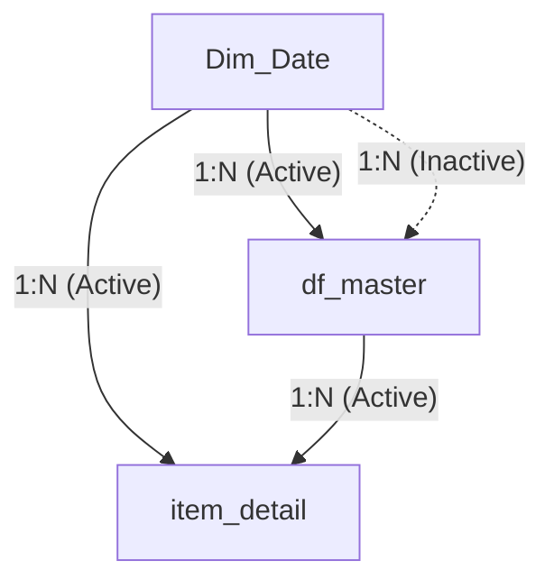

# Hướng dẫn Cấu hình Power BI & Công thức DAX - Brazilian E-Commerce

Tài liệu này cung cấp hướng dẫn chi tiết từng bước để cấu hình Nguồn dữ liệu, Mô hình hóa dữ liệu, Thiết lập kiểu dữ liệu chuẩn, công thức DAX, quy chuẩn trực quan và hướng dẫn thiết lập 5 visual chính để xây dựng Dashboard **"Midnight Executive"** trong Power BI Desktop với tỉ lệ khung hình **4:3**.

---

## 1. Kết nối & Quy đổi Kiểu dữ liệu (Data Import & Data Types)

Để tối ưu hóa hiệu năng, chúng ta kết nối Power BI trực tiếp tới cơ sở dữ liệu SQLite tại `Data/olist_analytics.db` thay vì nạp từ các tệp CSV thô. Khi import vào Power BI qua Power Query, SQLite thường chuyển tất cả các cột thành dạng **Text** hoặc **General**. Bạn **bắt buộc** phải quy đổi lại kiểu dữ liệu (Data Type) cho từng cột như sau để tránh lỗi tính toán:

### Bảng `df_master` (Fact table mức Đơn hàng)
* **Kiểu Text (Chuỗi ký tự):**
  * `order_id`, `customer_id`, `customer_unique_id`
  * `customer_state`, `customer_city`
  * `order_status`, `primary_payment_type`, `purchase_month`
* **Kiểu Date (Ngày - Khuyên dùng cho cột liên kết relationship):**
  * `order_purchase_timestamp` (Chuyển từ DateTime sang Date để khớp hoàn toàn với `Dim_Date[Date]`)
* **Kiểu Date/Time (Ngày giờ - Chọn Locale là English nếu cần):**
  * `order_approved_at`
  * `order_delivered_carrier_date`
  * `order_delivered_customer_date`
  * `order_estimated_delivery_date`
* **Kiểu Whole Number (Số nguyên):**
  * `purchase_year`, `item_count`, `product_count`, `seller_count`
  * `payment_count`, `max_installments`, `review_count`
  * `delivered_flag`, `late_flag`, `delivery_days`
* **Kiểu Fixed Decimal Number / Decimal Number (Số thập phân / Tiền tệ):**
  * `item_price`, `freight_value`, `item_gmv`, `payment_value`
  * `review_score`

### Bảng `item_detail` (Fact/Dimension table mức Chi tiết mặt hàng)
* **Kiểu Text (Chuỗi ký tự):**
  * `order_id`, `product_id`, `seller_id`, `customer_id`
  * `customer_state`, `seller_state`, `product_category_name_english`, `purchase_month`
* **Kiểu Date (Ngày - Khuyên dùng cho cột liên kết relationship):**
  * `order_purchase_timestamp` (Chuyển sang Date để khớp với `Dim_Date[Date]`)
* **Kiểu Date/Time (Ngày giờ):**
  * `order_delivered_customer_date`
  * `order_estimated_delivery_date`
* **Kiểu Whole Number (Số nguyên):**
  * `order_item_id`, `delivered_flag`, `late_flag`
* **Kiểu Fixed Decimal Number / Decimal Number (Số thập phân / Tiền tệ):**
  * `price`, `freight_value`, `review_score`

---

## 2. Mô hình hóa dữ liệu & Mối quan hệ (Data Modeling & Relationships)

> [!IMPORTANT]
> **CẢNH BÁO MẤT KHỚP DỮ LIỆU THỜI GIAN (DATETIME MISMATCH):**
> Trong Power BI, nếu cột liên kết của bảng Fact (`order_purchase_timestamp`) chứa thông tin giờ giấc chi tiết (ví dụ: `2017-11-24 16:30:22`) trong khi bảng `Dim_Date[Date]` chỉ chứa ngày (`2017-11-24 00:00:00`), mối quan hệ (Relationship) sẽ **không khớp** (chỉ khớp các giao dịch phát sinh đúng 12:00:00 AM).
>
> **Giải pháp khắc phục:**
> 1. **Cách 1 (Khuyên dùng - Power Query):** Tại Power Query, chọn cột `order_purchase_timestamp` ở cả hai bảng `df_master` và `item_detail` -> Chọn tab **Transform** -> Chuyển **Data Type** từ **Date/Time** sang **Date**. Điều này sẽ loại bỏ phần giờ và giúp liên kết khớp hoàn toàn 100%.
> 2. **Cách 2 (Sử dụng DAX):** Tạo cột tính toán mới bằng DAX ở bảng Fact: `Purchase_Date = DATEVALUE(df_master[order_purchase_timestamp])` và dùng cột này để liên kết với `Dim_Date[Date]`.

Để xây dựng một mô hình hình sao (Star Schema) chuẩn và tối ưu hóa hiệu năng lọc chéo, cấu hình các mối quan hệ trong tab **Model View** theo đúng các thông số sau:



### Chi tiết các mối quan hệ:

1. **Giữa `Dim_Date` và `df_master` (Liên kết chính theo ngày mua hàng):**
   * **Cột liên kết:** `Dim_Date[Date]` ───> `df_master[order_purchase_timestamp]` (đã chuyển về kiểu Date).
   * **Cardinality (Bản số):** One to many (1:*) (1 ngày có nhiều đơn hàng).
   * **Cross filter direction:** Single (Dim_Date lọc df_master).
   * **Trạng thái:** **Active** (Hoạt động).

2. **Giữa `Dim_Date` và `item_detail` (Liên kết ngày cho chi tiết mặt hàng):**
   * **Cột liên kết:** `Dim_Date[Date]` ───> `item_detail[order_purchase_timestamp]`
   * **Cardinality:** One to many (1:*).
   * **Cross filter direction:** Single.
   * **Trạng thái:** **Active** (Hoạt động).

3. **Giữa `df_master` và `item_detail` (Liên kết giữa Đơn hàng và Mặt hàng):**
   * **Cột liên kết:** `df_master[order_id]` ───> `item_detail[order_id]`
   * **Cardinality:** One to many (1:*) (1 đơn hàng có thể chứa nhiều mặt hàng).
   * **Cross filter direction:** Single (df_master lọc item_detail).
   * **Trạng thái:** **Active** (Hoạt động).

4. **Các liên kết ngày bổ sung (Để phân tích Logistics - Inactive):**
   * Nối `Dim_Date[Date]` sang `df_master[order_delivered_customer_date]` (1:*, Inactive).
   * Nối `Dim_Date[Date]` sang `df_master[order_estimated_delivery_date]` (1:*, Inactive).
   * *Sử dụng hàm `USERELATIONSHIP` trong DAX khi cần tính toán theo ngày giao thực tế hoặc ngày dự kiến.*

---

## 3. Thiết lập Bảng Ngày chuẩn (Dim_Date)

Tạo bảng lịch tự động để hỗ trợ các hàm Time Intelligence (như `SAMEPERIODLASTYEAR`):

### Bước 1: Tạo bảng bằng DAX
Chọn **Modeling** -> **New Table** và nhập:
```dax
Dim_Date = 
VAR MinDate = MIN(df_master[order_purchase_timestamp])
VAR MaxDate = MAX(df_master[order_purchase_timestamp])
RETURN
ADDCOLUMNS(
    CALENDAR(MinDate, MaxDate),
    "Year", YEAR([Date]),
    "Month Number", MONTH([Date]),
    "Month Name", FORMAT([Date], "MMMM"),
    "Month Short", FORMAT([Date], "MMM"),
    "Month-Year Number", YEAR([Date]) * 100 + MONTH([Date]),
    "Month-Year", FORMAT([Date], "YYYY-MM"),
    "Quarter", "Q" & QUARTER([Date]),
    "Week Number", WEEKNUM([Date]),
    "Day of Week", WEEKDAY([Date]),
    "Day of Week Name", FORMAT([Date], "dddd")
)
```

### Bước 2: Sắp xếp Cột (Sort by Column)
* Click chọn cột `Month Short` -> **Column tools** -> **Sort by column** -> Chọn **Month Number**.
* Click chọn cột `Month-Year` -> **Sort by column** -> Chọn **Month-Year Number**.

---

## 4. Công thức DAX Measures (KPIs & Metrics)

Tạo bảng ảo tên `_Measures` để quản lý tập trung các công thức:

### 4.1. Doanh thu thực tế (Realized Revenue)
```dax
Realized Revenue = CALCULATE(SUM(df_master[payment_value]), df_master[order_status] = "delivered")
```
* *Định dạng:* Currency, 2 chữ số thập phân (BRL / $).

### 4.2. Số đơn hàng thành công (Delivered Orders)
```dax
Delivered Orders = CALCULATE(DISTINCTCOUNT(df_master[order_id]), df_master[order_status] = "delivered")
```
* *Định dạng:* Whole number (Thêm dấu phân cách hàng nghìn).

### 4.3. Giá trị đơn hàng trung bình (AOV)
```dax
AOV = DIVIDE([Realized Revenue], [Delivered Orders], 0)
```
* *Định dạng:* Currency, 2 chữ số thập phân.

### 4.4. Tỷ lệ giao hàng đúng hạn (On-Time Delivery Rate)
```dax
On-Time Delivery Rate = 
DIVIDE(
    CALCULATE(
        DISTINCTCOUNT(df_master[order_id]), 
        df_master[order_status] = "delivered", 
        df_master[late_flag] = 0
    ), 
    [Delivered Orders], 
    0
)
```
* *Định dạng:* Percentage (%), 1 chữ số thập phân.

### 4.5. Tỷ lệ giao hàng trễ (Late Delivery Rate)
```dax
Late Delivery Rate = 1 - [On-Time Delivery Rate]
```
* *Định dạng:* Percentage (%), 1 chữ số thập phân.

### 4.6. Điểm đánh giá CSAT trung bình
```dax
CSAT Score = CALCULATE(AVERAGE(df_master[review_score]), df_master[order_status] = "delivered")
```
* *Định dạng:* Decimal, 2 chữ số thập phân.

### 4.7. Tăng trưởng doanh thu YoY
```dax
YoY Revenue Growth % = 
VAR CurrentRevenue = [Realized Revenue]
VAR PriorRevenue = CALCULATE([Realized Revenue], SAMEPERIODLASTYEAR(Dim_Date[Date]))
RETURN 
DIVIDE(CurrentRevenue - PriorRevenue, PriorRevenue, 0)
```
* *Định dạng:* Percentage (%), 1 chữ số thập phân.

### 4.8. Các công thức Sub-labels động cho KPI Cards (Card New)

#### 4.8.1. Nhãn phụ Doanh thu (Revenue Sub-label)
```dax
Revenue Sub-label = 
VAR Growth = [YoY Revenue Growth %]
RETURN 
IF(
    ISBLANK(Growth) || Growth = 0, 
    "No YoY Data", 
    IF(Growth >= 0, "▲ ", "▼ ") & FORMAT(ABS(Growth), "0.0%") & " YoY"
)
```

#### 4.8.2. Nhãn phụ Đơn hàng (Orders Sub-label)
* **Orders YoY Growth %:**
```dax
Orders YoY Growth % = 
VAR CurrentOrders = [Delivered Orders]
VAR PriorOrders = CALCULATE([Delivered Orders], SAMEPERIODLASTYEAR(Dim_Date[Date]))
RETURN 
DIVIDE(CurrentOrders - PriorOrders, PriorOrders, 0)
```
* **Orders Sub-label:**
```dax
Orders Sub-label = 
VAR Growth = [Orders YoY Growth %]
RETURN 
IF(
    ISBLANK(Growth) || Growth = 0, 
    "No YoY Data", 
    IF(Growth >= 0, "▲ ", "▼ ") & FORMAT(ABS(Growth), "0.0%") & " YoY"
)
```

#### 4.8.3. Nhãn phụ AOV (AOV Sub-label)
* **AOV YoY Growth %:**
```dax
AOV YoY Growth % = 
VAR CurrentAOV = [AOV]
VAR PriorAOV = CALCULATE([AOV], SAMEPERIODLASTYEAR(Dim_Date[Date]))
RETURN 
DIVIDE(CurrentAOV - PriorAOV, PriorAOV, 0)
```
* **AOV Sub-label:**
```dax
AOV Sub-label = 
VAR Growth = [AOV YoY Growth %]
RETURN 
IF(
    ISBLANK(Growth) || Growth = 0, 
    "No YoY Data", 
    IF(Growth >= 0, "▲ ", "▼ ") & FORMAT(ABS(Growth), "0.0%") & " YoY"
)
```

#### 4.8.4. Nhãn phụ Đúng hạn (On-Time Sub-label)
```dax
On-Time Sub-label = 
VAR SLA_Target = 0.90
VAR CurrentRate = [On-Time Delivery Rate]
RETURN 
"Target SLA: 90.0% (" & IF(CurrentRate >= SLA_Target, "Đạt SLA", "Vi phạm SLA") & ")"
```

#### 4.8.5. Nhãn phụ CSAT (CSAT Sub-label)
* **1-Star Review Rate:**
```dax
1-Star Review Rate = 
DIVIDE(
    CALCULATE(COUNT(df_master[order_id]), df_master[review_score] = 1, df_master[order_status] = "delivered"),
    CALCULATE(COUNT(df_master[order_id]), NOT(ISBLANK(df_master[review_score])), df_master[order_status] = "delivered"),
    0
)
```
* **CSAT Sub-label:**
```dax
CSAT Sub-label = 
VAR OneStarRate = [1-Star Review Rate]
RETURN 
FORMAT(OneStarRate, "0.0%") & " rate 1-star"
```

---

## 5. Hướng dẫn Cấu hình Chi tiết 5 Visuals chính (Detailed 5 Visuals Specifications)

### Visual 1: Dải thẻ chỉ số KPI (KPI Cards / Callout Cards)
Sử dụng visual **Card (New)** để tạo dải 5 chỉ số nằm ngang ở đầu trang:
* **Các trường dữ liệu:** Kéo thả các Measure tương ứng: `[Realized Revenue]`, `[Delivered Orders]`, `[AOV]`, `[On-Time Delivery Rate]`, `[CSAT Score]`.
* **Cấu hình Accent Line (Thanh viền chỉ báo):** Kích hoạt tính năng Accent Bar ở phía trên mỗi Card để phân nhóm trực quan:
  * Doanh thu & Đúng hạn: Màu xanh lục `#10b981`.
  * Đơn hàng: Màu xanh lam `#06b6d4`.
  * AOV: Màu tím `#8b5cf6`.
  * CSAT Score: Màu vàng cam `#f59e0b`.
* **Cấu hình Sub-labels (Reference Labels):** Thêm nhãn phụ nhỏ hiển thị thông tin xu hướng:
  * Dưới Doanh thu: Kéo thả `[Revenue Sub-label]` (Màu xanh lục).
  * Dưới Đơn hàng: Kéo thả `[Orders Sub-label]` (Màu xanh lam).
  * Dưới AOV: Kéo thả `[AOV Sub-label]` (Màu tím).
  * Dưới Đúng hạn: Kéo thả `[On-Time Sub-label]` (Màu xám `#94a3b8`).
  * Dưới CSAT: Kéo thả `[CSAT Sub-label]` (Màu đỏ nhạt `#ef4444`).

### Visual 2: Biểu đồ xu hướng Doanh thu hàng tháng (Monthly Revenue Trend - Area Chart)
* **Visual:** Area Chart (Biểu đồ vùng).
* **Trục X (X-Axis):** `Dim_Date[Month-Year]` (Định dạng: `yyyy-MM`).
* **Trục Y (Y-Axis):** Measure `[Realized Revenue]`.
* **Đường Line (Stroke):** Màu Cyan `#06b6d4`, Stroke width: 3pt.
* **Vùng Phủ (Area Fill):** Chọn màu `#06b6d4`, chỉnh độ trong suốt (Transparency) = 85% để tạo hiệu ứng phát sáng mờ dưới đường (Glow Effect) giống bản HTML mockup.
* **Ghi chú Đỉnh điểm (Data Callout / Text):** Thêm **Anomaly detection** hoặc một **TextBox/Callout** trỏ vào điểm đỉnh tháng 11/2017 với dòng chữ: *"BRL 1.16M - Black Friday Peak"* (Màu vàng cam `#f59e0b`).

### Visual 3: Biểu đồ Top 10 Ngành hàng Doanh thu (Top Categories - Clustered Bar Chart)
* **Visual:** Clustered Bar Chart (Biểu đồ cột nằm ngang).
* **Trục Y (Y-Axis):** `item_detail[product_category_name_english]`.
* **Trục X (X-Axis):** Measure `[Realized Revenue]`.
* **Filters Pane:** Lọc riêng cho visual này: Chọn **Top N** -> Nhập **10** -> Kéo thả `[Realized Revenue]` vào phần **By value**.
* **Màu sắc các cột (Columns Color):** Thiết lập Conditional Formatting theo thang màu Gradient từ màu xanh Cyan nhạt `#22d3ee` (Thứ hạng cao nhất) chuyển dần về xanh lam tối `#0e7490` (Thứ hạng thấp hơn).

### Visual 4: Bảng nhiệt rủi ro Logistics (Customer State Risk Matrix - Table/Matrix)
* **Visual:** Table hoặc Matrix.
* **Cột hiển thị (Columns):** `df_master[customer_state]` (Bang của khách hàng), `[Delivered Orders]` (Số đơn giao), `[Average Delivery Days]` (Số ngày giao TB), `[Late Delivery Rate]` (Tỷ lệ giao trễ).
* **Định dạng có điều kiện (Conditional Formatting):** Kích hoạt màu nền cho cột `[Late Delivery Rate]` để cảnh báo:
  * Dưới 10%: Nền màu lục nhạt (`#10b981` với độ mờ cao).
  * Từ 10% - 15%: Nền màu vàng cam (`#f59e0b` với độ mờ cao).
  * Trên 15%: Nền màu đỏ sẫm (`#ef4444` với độ mờ cao - ứng với các bang rủi ro cao AL, MA).
* **Sắp xếp bảng:** Click chọn cột `[Late Delivery Rate]` và sắp xếp giảm dần để các điểm nóng vận hành luôn hiển thị ở trên cùng.

### Visual 5: Danh sách Ngành hàng Ưu tiên & Giả lập Rủi ro (Priority Categories & Risk Simulation)
* **BIP Optimization Table (Visual: Table):**
  * Sử dụng bảng `category_optimization_top10` (hoặc nạp từ tệp `category_optimization_top10.csv`).
  * Hiển thị các trường: `selected_rank` (Thứ hạng), `product_category_name_english`, `item_price_revenue` (Doanh thu), `avg_review_score` (Điểm CSAT), `avg_freight_per_item` (Cước TB).
  * Định dạng: Background tối `#111827`, tắt lưới ngang dọc (Gridlines = Off) để tạo phong cách tối giản.
* **Monte Carlo Simulation Cards (Visual: Card New / KPI Cards):**
  * Tạo 2 ô con nhỏ cạnh nhau để hiển thị kết quả mô phỏng rủi ro:
    * Ô 1 (Revenue Downside Risk): Giá trị hiển thị **21.4%** (Chữ màu tím `#8b5cf6`). Nhãn mô tả: *"Xác suất doanh thu danh mục trọng tâm giảm quá 20% so với kỳ vọng (Mean: BRL 248K)"*.
    * Ô 2 (SLA Delivery Risk): Giá trị hiển thị **1.7%** (Chữ màu xanh lục `#10b981`). Nhãn mô tả: *"Xác suất tỷ lệ giao hàng trễ vượt ngưỡng 10% SLA cho phép. Cực kỳ an toàn"*.

---

## 6. Quy chuẩn Kích thước Chữ & Trực quan (4:3 Canvas Typography)

Để đảm bảo dashboard hiển thị sắc nét trên tỷ lệ **4:3** mà không bị quá nhỏ hay tràn viền khi xem trên Power BI Service, áp dụng cấu hình font hệ thống **Segoe UI** hoặc **Inter** với kích thước chuẩn xác dưới đây:

### 6.1. Cấu hình Trang và Nền
* **Page Size Type:** Custom -> Width: **1200 Pixels**, Height: **900 Pixels** (Tỉ lệ 4:3 chuẩn kỹ thuật, tối ưu hóa mật độ điểm ảnh của Power BI).
* **Page Background:** Màu tối `#0b0f19` (Transparency = 0%).

### 6.2. Nhóm Tiêu đề & Bộ lọc (Header & Slicers)
* **Tiêu đề Dashboard chính:**
  * Font size: **18 pt**, Bold. Màu `#f8fafc` hoặc gradient.
  * Phụ đề: **9 pt**, Regular. Màu `#94a3b8` (Muted text).
* **Badge (Sales Director Panel):**
  * Font size: **8 pt**, Semibold. Màu Cyan `#22d3ee`, nền `#062d3c` với bo góc tối đa (Pill shape).
* **Slicers (Bộ lọc dạng Dropdown):**
  * Label (Tên bộ lọc): **8 pt**, Semibold. Màu `#94a3b8` (Text-transform: Uppercase).
  * Values (Giá trị chọn): **8.5 pt**, Regular. Màu `#f8fafc`. Nền dropdown: `#1f2937`.

### 6.3. Thẻ Chỉ số (KPI Cards - Visual Card New)
* **Card Title (Tên chỉ số):**
  * Font size: **8.5 pt**, Semibold, Uppercase. Màu `#94a3b8`.
* **Callout Value (Chỉ số chính):**
  * Font size: **24 pt** (Tránh đặt >28pt để không bị lỗi `...` khi hiển thị số tiền lớn như BRL 15.42M trên màn hình nhỏ).
  * Font style: Bold. Màu `#f8fafc`.
* **Sub-label/Trend (Nhãn phụ động bên dưới):**
  * Font size: **8.5 pt**, Regular/Semibold.
  * *Màu sắc động:* Xanh lục `#10b981` cho tăng trưởng tốt, Vàng cam `#f59e0b` hoặc Đỏ `#ef4444` cho cảnh báo, Muted `#94a3b8` cho thông tin trung lập.

### 6.4. Biểu đồ Vùng & Cột (Area & Bar Charts)
* **Visual Title (Tiêu đề biểu đồ con):**
  * Font size: **10 pt**, Bold. Màu `#f8fafc` hoặc Cyan `#06b6d4`.
* **Trục X & Trục Y (Labels):**
  * Font size: **8.5 pt**, Regular. Màu `#94a3b8`.
  * *Lưu ý:* Đối với biểu đồ cột ngang danh mục, đặt font trục Y là **8.5 pt** để hiển thị trọn vẹn tên các danh mục dài như `computers_accessories`.
* **Data Labels (Nhãn dữ liệu hiển thị trên cột/đường):**
  * Font size: **8.5 pt**, Bold. Màu `#f8fafc`.

### 6.5. Bảng & Ma trận (Logistics & BIP Tables)
Để hiển thị được nhiều dòng dữ liệu mà không cần cuộn trang trên màn hình 4:3:
* **Table Header (Tiêu đề cột):**
  * Font size: **9 pt**, Bold. Màu `#94a3b8`. Nền header: `#111827`.
* **Values (Dữ liệu dòng):**
  * Font size: **8.5 pt**, Regular. Màu `#f8fafc`.
* **Row Padding (Khoảng cách dòng):**
  * Thiết lập độ giãn dòng (Padding) ở mức **Sparse** hoặc chỉnh tay **Row Padding = 4 - 5 px** để tối ưu hóa không gian hiển thị.
* **Conditional Formatting Badges:**
  * Font size của nhãn trạng thái (Critical, Warning, Normal): **7.5 pt**, Bold.

---

## 7. Tích hợp Bộ lọc Tương tác (Slicers Bar)

Đặt một thanh chứa 4 bộ lọc ngang phía dưới tiêu đề chính để phục vụ tương tác:
1. **Slicer Thời gian:** Chọn dạng *Between* hoặc *Dropdown* lọc cột `df_master[order_purchase_timestamp]`.
2. **Slicer Bang Khách hàng:** Dropdown lọc cột `df_master[customer_state]`.
3. **Slicer Bang Người bán:** Dropdown lọc cột `item_detail[seller_state]`.
4. **Slicer Top N:** Dropdown lọc theo các điều kiện lọc sẵn.

*Đảm bảo tất cả các Slicer được định dạng theo kiểu "Tile" hoặc "Dropdown" với màu nền tối `#1f2937` để hòa hợp với tông màu Midnight Executive chung.*
